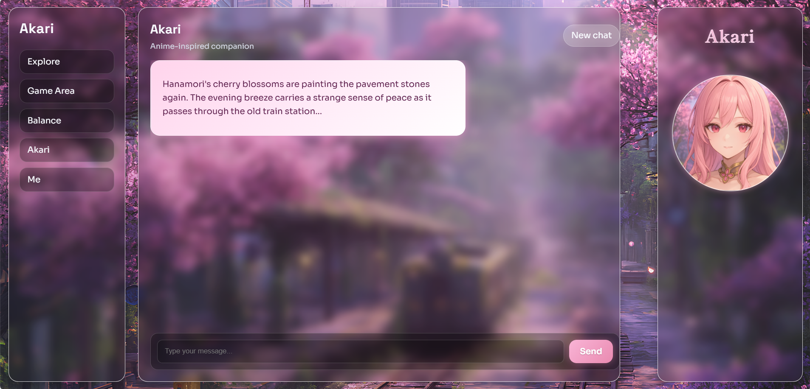
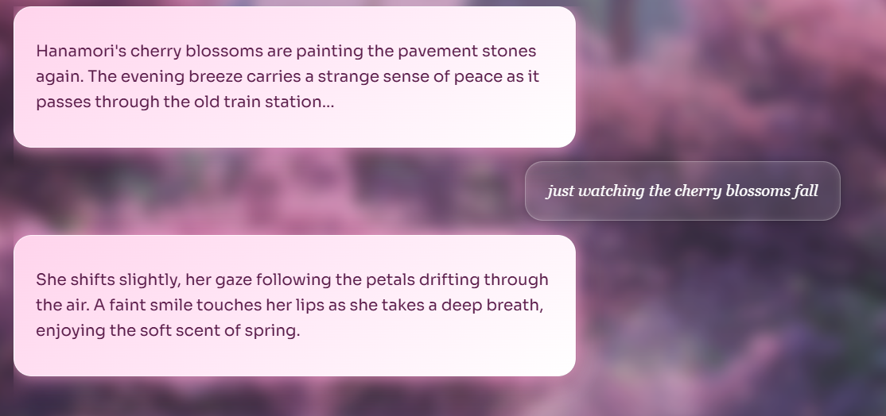
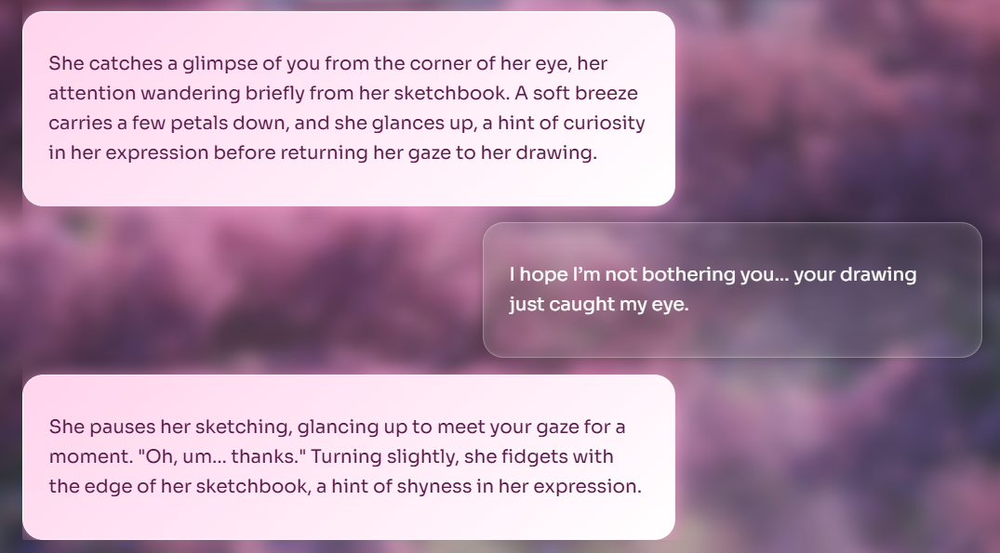
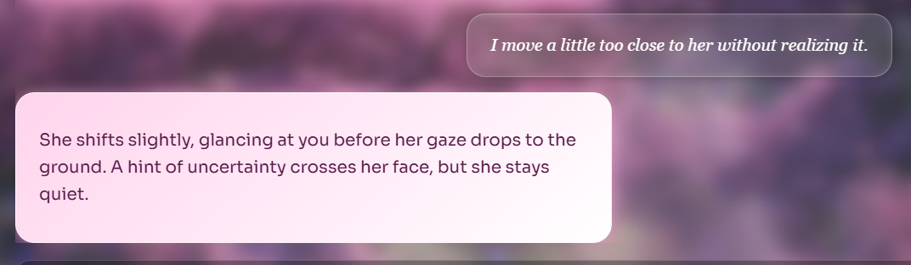
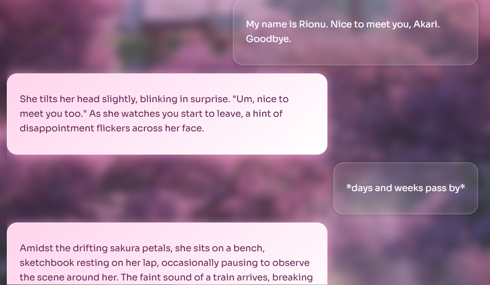
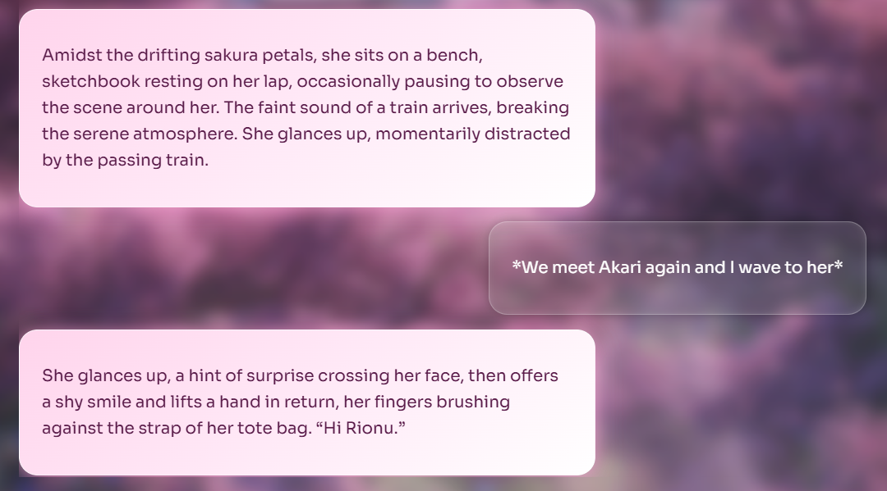

<p align="center">
  
</p>

# Akari — A Grounded, Human-Like AI Character

<br>
𝘼𝙠𝙖𝙧𝙞 𝙞𝙨 𝙖𝙣 𝙚𝙭𝙥𝙚𝙧𝙞𝙢𝙚𝙣𝙩𝙖𝙡 𝙘𝙤𝙣𝙫𝙚𝙧𝙨𝙖𝙩𝙞𝙤𝙣𝙖𝙡 𝘼𝙄,<br>
𝙢𝙚𝙖𝙣𝙩 𝙩𝙤 𝙛𝙚𝙚𝙡 𝙡𝙞𝙠𝙚 𝙖 𝙧𝙚𝙖𝙡 𝙥𝙚𝙧𝙨𝙤𝙣 —<br>
𝙦𝙪𝙞𝙚𝙩, 𝙤𝙗𝙨𝙚𝙧𝙫𝙖𝙣𝙩, 𝙝𝙚𝙨𝙞𝙩𝙖𝙣𝙩,<br>
𝙨𝙤𝙢𝙚𝙩𝙞𝙢𝙚𝙨 𝙪𝙣𝙨𝙪𝙧𝙚.<br><br>

𝙎𝙝𝙚 𝙚𝙭𝙞𝙨𝙩𝙨 𝙞𝙣 𝙃𝙖𝙣𝙖𝙢𝙤𝙧𝙞 —<br>
𝙖 𝙨𝙖𝙠𝙪𝙧𝙖-𝙡𝙞𝙣𝙚𝙙 𝙘𝙤𝙖𝙨𝙩𝙖𝙡 𝙩𝙤𝙬𝙣,<br>
𝙬𝙝𝙚𝙧𝙚 𝙜𝙚𝙣𝙩𝙡𝙚 𝙢𝙤𝙢𝙚𝙣𝙩𝙨 𝙢𝙖𝙩𝙩𝙚𝙧<br>
𝙢𝙤𝙧𝙚 𝙩𝙝𝙖𝙣 𝙡𝙤𝙣𝙜 𝙘𝙤𝙣𝙫𝙚𝙧𝙨𝙖𝙩𝙞𝙤𝙣𝙨.<br><br>

𝙏𝙝𝙚 𝙜𝙤𝙖𝙡 𝙞𝙨 𝙚𝙢𝙤𝙩𝙞𝙤𝙣𝙖𝙡 𝙧𝙚𝙖𝙡𝙞𝙨𝙢,<br>
𝙨𝙪𝙗𝙩𝙡𝙚 𝙐𝙄, 𝙖𝙣𝙙 𝙖𝙩𝙢𝙤𝙨𝙥𝙝𝙚𝙧𝙚-𝙙𝙧𝙞𝙫𝙚𝙣 𝙙𝙚𝙨𝙞𝙜𝙣.


<br clear="both" />


## Core Experience

Akari does not follow scripted storytelling, dialogue trees, or personality resets.
Every response emerges from context, memory, pacing, and social awareness.

Below are the seven behaviors that define her:

---

## UI & Atmosphere


---

### 1) Atmospheric First Contact
Akari doesn’t greet or introduce herself — she already exists in her world.  
The interaction begins quietly, shaped by timing and presence.



---

### 2) Natural Social Behavior — No Forced Conversation
She doesn’t immediately speak.  
She may glance up, adjust her sketchbook, or let silence exist naturally.


---

### 3) Imperfect Human Reactions — Not Scripted Affection
Compliments, invitations, or emotional topics can lead to hesitation, confusion,
or polite distance — never forced enthusiasm.



---

### 4) Environment-Aware Responses
Akari reacts to trains passing, petals falling, footsteps, distant vending machines —
the world is part of the conversation.


---

### 5) Autonomy & Personal Boundaries
She has preferences and limits.  
She can decline, withdraw, redirect, or leave — like a real person.



---

### 6) Independent Choices — Not Designed to Please
She doesn’t automatically agree, apologize, or comply.  
Her responses depend on comfort, familiarity, and emotional context.


---

### 7) Persistent Memory
Leaving and returning doesn’t reset anything.  
Akari remembers the setting, shared actions, tone, and ongoing moment.




---

## Technology

- React + Vite
- OpenAI API
- Client-side architecture
- No backend or database required

---

## Local Setup

```bash
git clone https://github.com/rionu/akari-ai-companion
cd akari-ai-companion
npm install
